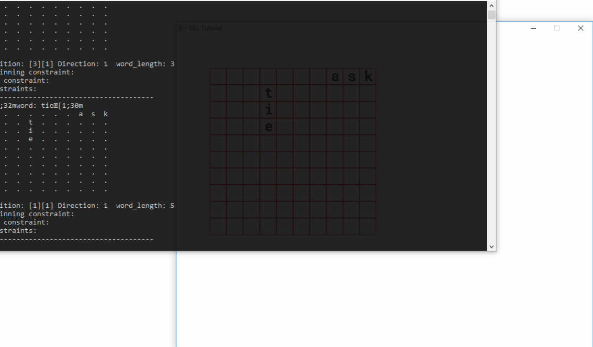

# Crossword puzzle
The application is capable of creating a crossword puzzle. This is applied solution to Constraint Satisfaction Problem.

# Table of contents
1. [Demo](#demo)
2. [Getting started](#getting_started)
	1. [Linux](#gtstLinux)
	2. [Windows](#gtstWindows)

# Demo <a name="demo"></a>
<p align="center">
  
</p>

# Getting started <a name="getting_started"></a>
## Linux <a name="gtstLinux"></a>
### Prerequisites
Build:
```
sudo apt install cmake
```
Tests:
```
sudo apt install libgtest-dev
cd /usr/src/gtest
sudo cmake CMakeLists.txt
sudo make
sudo cp *.a /usr/lib
```
Running the application - SDL library:
```
sudo apt install libsdl2-dev
sudo apt install libsdl2-image-dev
sudo apt install libsdl2-ttf-dev
```

### Running the application 
Compiling:
```
mkdir build
cd build
cmake ..
make
```
Running application:
```
./crossword_puzzle
```

## Windows <a name="gtstWindows"></a>
### Prerequisites
Follow instructions from given websites.
+ [MinGW](https://sourceforge.net/projects/mingw-w64/ "MinGW-w64 for Windows 32 and 64 bit.")
+ [CMake](https://cmake.org/download/ "CMake download official website.")
+ [Gtest](https://github.com/iat-cener/tonatiuh/wiki/Installing-Google-Test-For-Windows "Installing GoogleTest for Windows.")(Required only for testing)
+ [SDL2](https://www.libsdl.org/download-2.0.php "Download SDL2 library for Windows.")

### Running the application 
Compiling with MinGW:
```
mkdir build
cd build
cmake .. -G "MinGW Makefiles"
mingw32-make
```